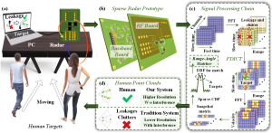
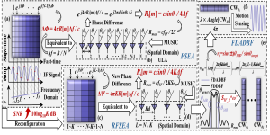
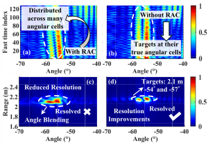
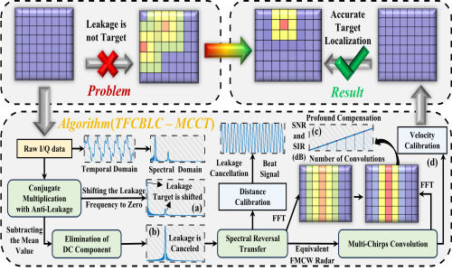
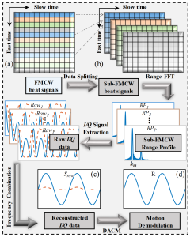
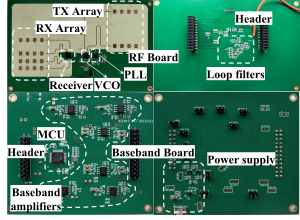
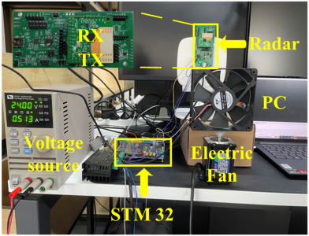








I am currently a third-year Ph.D student in the [School of Electronic Information and Electrical Engineering](https://www.seiee.sjtu.edu.cn/) at Shanghai Jiao Tong University of China, where I am supervised by [Prof. Junfa Mao](https://www.sjtu.edu.cn/jdld/20181024/85893.html) (Academician of CAS, IEEE Fellow) and [Prof. Changzhan Gu](https://changzhan.sjtu.edu.cn/). Before that, I got my bachelor's degree at [Xidian University](https://www.xidian.edu.cn/), supervised by [Prof. Ying Liu](https://web.xidian.edu.cn/liuying/) (IEEE Fellow) and [Prof. Shuai Zhang](https://faculty.xidian.edu.cn/ZS3/zh_CN/index/369813/list/index.htm). During my undergraduate studies, I ranked first in my major, achieved the highest score since the establishment of the major, and was directly admitted to the Ph.D.

I have received over ten honors and awards, including the National Scholarship, Outstanding Graduate of Shaanxi Province, the Jiachi Yang Academician Scholarship and so on. Moreover, I have received three times’ Best/Excellent Paper Awards from IEEE conferences as an author/coauthor. Additionally, I have won nine provincial and higher-level awards in competitions, such as the "Challenge Cup" National College Student Academic and Technology Competition, the National/International Mathematical Modeling Competition, the National College Student Computer Design Competition, the National College Student Mathematics Competition, among others.

My research interests include 4-D millimeter-wave MIMO radar systems and sensing algorithms. I have published more than 10 papers and I have been involved in projects such as National Key R&D Program of China and Natural Science Foundation of China.

# 📖 Educations

- *2022.09 - Present*, *Ph.D* in Electronic science and technology, Shanghai Jiao Tong University, Shanghai, China

  State Key Laboratory of Radio Frequency Heterogeneous Integration

  Supervisor: [*Prof. Junfa Mao*](https://www.sjtu.edu.cn/jdld/20181024/85893.html) (*Academician of CAS*, *IEEE Fellow*) and [*Prof. Changzhan Gu*](https://changzhan.sjtu.edu.cn/)

- *2018.09 - 2022.06*, *B.S.* in Electromagnetic field and wireless technology, Xidian University, Shaanxi, China
  
  National Key Laboratory of Radar Detection and Sensing
  
  Supervisor: [*Prof. Ying Liu*](https://web.xidian.edu.cn/liuying/) (*IEEE Fellow*) and [*Prof. Shuai Zhang*](https://faculty.xidian.edu.cn/ZS3/zh_CN/index/369813/list/index.htm), *GPA: 3.96/4.00, Grade: 96.3/100, Rank: 1/33* (The highest score since the establishment of the major)

# 🔥 News

- *2025.05*: &nbsp;🎉🎉 I am greatly honored to won the 3rd prize of best student paper award in NCMMW2025! 
- *2025.04*: &nbsp;🎉🎉 One paper (first author) on RF leakage and static clutter cancellation for 24 GHz Short-Range End-to-end Sparse MIMO FMCW Radar System is accepted by T-MTT!
- *2025.04*: &nbsp;🎉🎉 Three papers (one as the first author) on millimeter-wave radar systems, infant vital sign monitoring, and range extension technologies are accepted by NCMMW, IWS, and ICMMT, respectively!
- *2025.04*: &nbsp;🎉🎉 Two papers (first author) on range-angle decoupling and high-precision motion sensing of close-spaced targets are accepted by MWTL and Sensors Journal, respectively!
- *2025.02*: &nbsp;🎉🎉 One paper (first author) on range-angle decoupling in IMS2025 was selected as a Top 50 Paper and invited for submission to MWTL!
- *2025.02*: &nbsp;🎉🎉 Three papers (first author) on DCG sensing, range-angle decoupling and large-scale motion sensing are accepted by IMS2025! 
- *2025.01*: &nbsp;🎉🎉 I became the President of Shanghai Student Branch, [IEEE Microwave Theory and Technology Society](https://mtt.org/)！
- *2024.12*: &nbsp;🎉🎉 I became a reviewer for  [IEEE Transactions on Microwave Theory and Techniques](https://ieeexplore.ieee.org/xpl/RecentIssue.jsp?punumber=22)！
- *2024.09*: &nbsp;🎉🎉 I serving as a TPC-Member for [2024 IEEE International Conference on Signal, Information and Data Processing](http://icsidp.org/index.asp)！
- *2024.08*: &nbsp;🎉🎉 I am greatly honored to won the 1st prize of best student paper award in ACES-China2024! 
- *2024.07*: &nbsp;🎉🎉 I am greatly honored to receive the Jiachi Yang Academician Scholarship! 
- *2024.07*: &nbsp;🎉🎉 One paper (first author) on non-contact vital sign detection for multiple persons at short-range is accepted by ACES-China2024!
- *2024.03*: &nbsp;🎉🎉 One paper (first author) on millimeter-wave radar real-time human positioning system is accepted by ICMMT2024! 
- *2024.03*: &nbsp;🎉🎉 Two papers on millimeter-wave radar motion sensing are accepted by IWS2024! They won the IEEE MTT-S Flash Competition second place and the MVC Competition third place, respectively! Congrats to Zhiwei and Keke!  
- *2024.03*: &nbsp;🎉🎉 One paper on millimeter-wave radar motion sensing is accepted by T-MTT! Congrats to Zhiwei!
- *2024.02*: &nbsp;🎉🎉 One paper on Low-IF doppler radar is accepted by IMS2024! Congrats to Zhiwei!
- *2024.01*: &nbsp;🎉🎉 One paper (first author) on RF leakage suppression for FMCW radar indoor sensing is accepted by T-MTT!

# 📝 Publications

## **Journal Papers:**

    
    
IEEE T-MTT

  

 

    <h2 style="margin: 0;">
      <a href="https://ieeexplore.ieee.org/document/11005633" style="color: black; text-decoration: none;">
        Frequency-Domain Leakages and Stationary Clutters Cancellation Technique With a K-Band Short-Range End-to-end Sparse MIMO FMCW Radar System
      </a>
    </h2>
    
<strong>Jiayu Zhang</strong>, Zhiwei Zhang, Yuchen Li, Changzhan Gu* and Junfa Mao

    
<em><strong>IEEE Transactions on Microwave Theory and Techniques, 2025</strong></em>

    <ul style="list-style-type: disc; padding-left: 20px;margin-top: 10;">
      <li>This technology can be applied to MIMO FMCW radar for RF leakage and static clutter cancellation.</li>
      <li>The frequency-domain characteristics of the intermediate frequency (IF) signal are used to effectively remove interference targets such as leakage and static clutter, enabling accurate target detection. This approach is validated using a custom-designed 24 GHz sparse MIMO FMCW radar system and applied to multi-person point cloud trajectory detection in indoor environments.</li>
    </ul>
  

------

    
    
IEEE Sensors J.

  

 

    <h2 style="margin: 0;">
      <a href="https://ieeexplore.ieee.org/document/10965885" style="color: black; text-decoration: none;">
        Reconfigurable Frequency-Spatial Equivalent Array Based on FMCW Radar for Accurate Close-Spaced Multi-Targets Motions Sensing
      </a>
    </h2>
    
<strong>Jiayu Zhang</strong>, Zhiwei Zhang, Yuchen Li, Changzhan Gu* and Junfa Mao

    
<em><strong>IEEE Sensors Journal, 2025</strong></em>

    <ul style="list-style-type: disc; padding-left: 20px;margin-top: 10;">
      <li>This technology can be applied to FMCW radar for close-spaced target resolution and high-precision motion sensing.</li>
      <li>Utilizing frequency-spatial equivalent arrays and adaptive frequency domain beamforming technology to achieve close-spaced target resolution and reduce spectral mutual interference of targets for high-precision motion demodulation.</li>
    </ul>
  

------

 

    
    
IMS Top50→IEEE MWTL

  

 

    <h2 style="margin: 0;">
      <a href="https://ieeexplore.ieee.org/document/10966424" style="color: black; text-decoration: none;">
        Frequency-Spatial Adaptive Beamforming Technique for Range-Angle Decoupling With High-Resolution MIMO Radar
      </a>
    </h2>
    
<strong>Jiayu Zhang</strong>, Yuchen Li, Zhiwei Zhang, Changzhan Gu* and Junfa Mao

    
<em><strong>IEEE Microwave and Wireless Technology Letters, 2025</strong></em>

    <ul style="list-style-type: disc; padding-left: 20px;margin-top: 10;">
      <li>This technology can be applied to MIMO radar for range-angle decoupling.</li>
      <li>Utilizing frequency-space adaptive beamforming technology to improve system resolution (in range and angle) is of significant importance for autonomous driving applications.</li>
    </ul>
  

------

  

    
    
IEEE T-MTT

  

  

    <h2 style="margin: 0;">
      <a href="https://ieeexplore.ieee.org/document/10443219/" style="color: black; text-decoration: none;">
        Target Detection With Short-Range FMCW Radar Based on Time–Frequency Characteristic-Based Leakage Cancellation Technique
      </a>
    </h2>
    
<strong>Jiayu Zhang</strong>, Zhiwei Zhang, Yuchen Li, Changzhan Gu* and Junfa Mao

    
<em><strong>IEEE Transactions on Microwave Theory and Techniques, 2024</strong></em>

    <ul style="list-style-type: disc; padding-left: 20px;margin-top: 10;">
      <li>This technology can be applied to FMCW radar for short-range detection and RF leakage suppression.</li>
      <li>Utilizing time-frequency Characteristics and equivalent FMCW radar technology can improve SIR and SNR by 30 dB and 17 dB, respectively.</li>
    </ul>
  

------

  

    
    
IEEE T-MTT

  

  

    <h2 style="margin: 0;">
      <a href="https://ieeexplore.ieee.org/document/10494589" style="color: black; text-decoration: none;">
        Enhanced Motion Sensing With FMCW Radar Based on a Novel Frequency-Reconfigurable Technique
      </a>
    </h2>
    
Zhiwei Zhang, <strong>Jiayu Zhang</strong>, Jingtao Liu, Changzhan Gu* and Junfa Mao

    
<em><strong>IEEE Transactions on Microwave Theory and Techniques, 2024</strong></em>

    <ul style="list-style-type: disc; padding-left: 20px;margin-top: 10;">
      <li>This technology can be applied to enhance motion sensing in millimeter-wave radar.</li>
      <li>Using equivalent FMCW radar technology, the equivalent signal wavelength can be arbitrarily increased or decreased to achieve precise demodulation of large or small displacements. This improves the accuracy of small displacement detection by three times and the accuracy of large displacement detection by ten times.</li>
    </ul>
  

------

## **Conference Papers:**

- NCMMW2025 **张嘉宇**, 顾昌展\* 和 毛军发, “K波段2T4R稀疏MIMO FMCW雷达系统的设计与应用,” ***全国微波毫米波会议(NCMMW), 2025.*** (Best Student Paper Award, 3rd Prize)
- IWS2025 Yiyan Cao, **Jiayu Zhang** and Changzhan Gu\*, “Accurate Infant Respiratory Monitoring and Apnea Detection System With Time-Domain Enhancement Technique Based on FMCW radar,” ***IEEE MTT-S International Wireless Symposium (IWS), 2025.***
- ICMMT2025 Keke Zheng, **Jiayu Zhang**, Jingtao Liu, Changzhan Gu\* and Junfa Mao, “Extended Maximum Measurable Range via Fewer Sample points Using Sparse-Sampling CBF Frequency Estimation in FMCW Radar,” ***International Conference on Microwave and Millimeter Wave Technology (ICMMT), 2025.***
- IMS2025 **Jiayu Zhang**, Shuqin Dong, Yuchen Li, Yiyan Cao, Zhiwei Zhang, Changzhan Gu\* and Junfa Mao, “Accurate Doppler Cardiogram Sensing With Frequency-Domain Digital Beamforming Technique Based on a K-Band Biomedical Radar,” ***IEEE MTT-S International Microwave Symposium (IMS), 2025.***
- IMS2025 **Jiayu Zhang**, Zhiwei Zhang, Yuchen Li, Changzhan Gu\* and Junfa Mao, “Accurate Large-Scale Motion Sensing With FMCW Radar Based on Range-Dependent DFT Technique,” ***IEEE MTT-S International Microwave Symposium (IMS), 2025.***
- Aces-China2024 **Jiayu Zhang**, Zhiwei Zhang, Yuchen Li, Changzhan Gu\* and Junfa Mao, “[Target Localization and Vital Signs Monitoring Based on Spatial-Temporal-Frequency Characteristics With Short-Range FMCW Radar](https://xploreqa.ieee.org/document/10699972),” ***International Applied Computational Electromagnetics Society Symposium (Aces-China), 2024.***  (Best Student Paper Award, 1st Prize)
- ICMMT2024 **Jiayu Zhang**, Zhiwei Zhang, Yuchen Li, Changzhan Gu\* and Junfa Mao, “[Real-Time Human Motion Tracking Technique Based On a 77 GHz FMCW MIMO Radar System](https://ieeexplore.ieee.org/document/10672135),” ***International Conference on Microwave and Millimeter Wave Technology (ICMMT), 2024.***
- IWS2024 Zhiwei Zhang, **Jiayu Zhang**, Yuchen Li and Changzhan Gu\*, “[Enhanced Micrometer-Scale Motion Sensing Using a Reconfigurable Virtual CW Algorithm Based on 60 GHz FMCW Radar](https://ieeexplore.ieee.org/document/10713709),” ***IEEE MTT-S International Wireless Symposium (IWS), 2024.*** (IEEE MTT-S MVC Competition Third Place Winner)
- IWS2024 Keke Zheng, **Jiayu Zhang**, Yuchen Li, Changzhan Gu\* and Junfa Mao, “[A Novel Data-Based DC Offset Calibration Technique for Millimeter-wave Interferometric Sensing of Weak Displacement Motions](https://ieeexplore.ieee.org/document/10713800),” ***IEEE MTT-S International Wireless Symposium (IWS), 2024.*** (IEEE MTT-S Flash Competition Second Place Winner)
- IMS2024 Zhiwei Zhang, Fei Tong, **Jiayu Zhang** and Changzhan Gu\*, “[A Cost-Effective Single-Channel Displacement Measurement Technique Without Down-Conversion Using Low-IF Doppler Radar](https://ieeexplore.ieee.org/document/10600334),” ***IEEE MTT-S International Microwave Symposium (IMS), 2024.*** 
- IWS2023 **Jiayu Zhang**, Yuchen Li, Wenjie Li, Zhiwei Zhang, Changzhan Gu\* and Junfa Mao, “[Multi-Chirps Convolution Technique for Range Spectrum Signal Enhancement Based on a 60-GHz MIMO FMCW Radar](https://ieeexplore.ieee.org/document/10222617),” ***IEEE MTT-S International Wireless Symposium (IWS), 2023.*** (Selected for the MVC Competition Finalist)
- IWS2023 Zhiwei Zhang, **Jiayu Zhang**, Jingtao Liu, Changzhan Gu\* and Junfa Mao, “[Accurate Heart Rate Estimation Based on Multi-Channel Cross-Correlation with a 60-GHz FMCW Radar](https://ieeexplore.ieee.org/document/10221898),” ***IEEE MTT-S International Wireless Symposium (IWS), 2023.*** (Selected for the Flash Competition Finalist)
- IWS2023 Wenjie Li, Yuchen Li, **Jiayu Zhang**, jingyun Lu, Changzhan Gu\* and Junfa Mao, “[A Receiver Reconfigurable Method for Indoor Human Detection with 60GHz MIMO FMCW Radar](https://ieeexplore.ieee.org/document/10222158),” ***IEEE MTT-S International Wireless Symposium (IWS), 2023.*** (Selected for the MVC Competition Finalist)
- IMS2023 Wenjie Li, Yuchen Li, **Jiayu Zhang**, Shuqin Dong, jingyun Lu, Changzhan Gu\* and Junfa Mao, “[A Feature-based Filtering Algorithm with 60GHz MIMO FMCW Radar for Indoor Detection and Trajectory Tracking](https://ieeexplore.ieee.org/document/10188205),” ***IEEE MTT-S International Microwave Symposium (IMS), 2023.***

------

## **Patents:**

- **MIMO调频毫米波雷达阵列可重构阵列模式共用方法, 国家发明专利, 申请号: CN202311348159.8 (Granted)**
- **MIMO调频连续波雷达的室内优化定位方法, 国家发明专利,  申请号: CN202311348300.4 (Granted)**
- **基于K波段近距端到端稀疏MIMO FMCW雷达系统, 国家发明专利,  申请号: CN202510008228.3 (Granted)**
- **高分辨率MIMO雷达的频率-空间自适应数字波束成形方法, 国家发明专利,  申请号: CN202510266765.8 (Granted)**
- **基于K波段连续波FDDBF的DCG检测方法, 国家发明专利,  申请号: CN202510266766.2 (Granted)**

# 💻 Systems

  

    
    
24-GHz Sparse MIMO radar system

  

  

    <h2 style="margin: 0;">
      <a style="color: black; text-decoration: none;">
        24 GHz 2T4R sparse MIMO millimeter-wave radar system  
      </a>
    </h2>
    <ul style="list-style-type: disc; padding-left: 20px;margin-top: 10;">
      <li>The system uses ADF5901, ADF5904, and ADF4159 chips for the RF design, enabling FMCW or CW operating modes.</li>
      <li>Using an improved genetic algorithm for array layout design to achieve a 2T4R sparse arrangement, resulting in a 32% improvement in resolution compared to traditional layouts. The side lobe level is below -10 dB, and the FOV is within -50° to 50°.</li>
      <li>This system can be used for indoor positioning and multi-person point cloud trajectory tracking.</li>
    </ul>
  

  

    
    
77-GHz MIMO FMCW real-time radar system

  

  

    <h2 style="margin: 0;">
      <a style="color: black; text-decoration: none;">
        77-GHz MIMO FMCW radar system for real-time human motion tracking  
      </a>
    </h2>
    <ul style="list-style-type: disc; padding-left: 20px;margin-top: 10;">
      <li>This system uses the Andar ADT3102 radar to detect human target within the FOV and enables the fan to rotate in real-time following the human target.</li>
      <li>This system detects the range and angle information of the target and transmits them to the STM32 via the serial port. The STM32 generates corresponding PWM waves to control the motor's real-time rotation based on the target's spatial information, with an accuracy within 2.2°. This enables accurate real-time target positioning and tracking.</li>
    </ul>
  

# 🏅 Honors and Awards

- *2024.08* IEEE ACES-China 2024 Best Student Paper Award, 1st Prize
- *2024.07* Jiachi Yang Academician Scholarship
- *2024.05* IEEE MTT-S IWS 2024 MVC Competition Third Place Winner
- *2024.05* IEEE MTT-S IWS 2024 Flash Competition Second Place Winner
- *2022.06* Outstanding Graduates of Shaanxi Province
- *2022.06* Campus Talent Ambassador of Xidian University
- *2021.09* First Prize Scholarship and Outstanding Student of Xidian University
- *2020.09* National Scholarship
- *2020.09* First Prize of “2-781” Scholarship at Xidian University
- *2020.09* First Prize Scholarship and Outstanding Student of Xidian University
- *2019.09* First Prize Scholarship and Outstanding Student of Xidian University

# 👨‍💻 Academic activities
- *2025.01 - 2026.01* President of Shanghai Student Branch, IEEE Microwave Theory and Techniques Society
- *2024.12* I became a reviewer for  [IEEE Transactions on Microwave Theory and Techniques](https://ieeexplore.ieee.org/xpl/RecentIssue.jsp?punumber=22)
- *2024.09* I was a TPC-Member for [2024 IEEE International Conference on Signal, Information and Data Processing](http://icsidp.org/index.asp)
- *2023.03 - 2025.01* Academic Director of Shanghai Student Branch, IEEE Microwave Theory and Techniques Society

    

